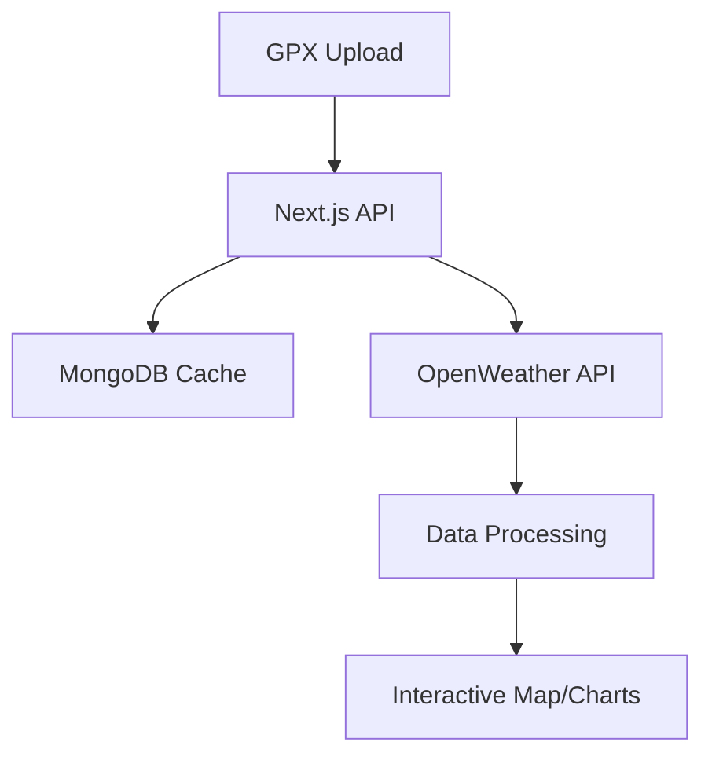

# RideWeather Planner

> A premium weather planning application for outdoor activities

A premium, beautifully designed Next.js application for planning routes with detailed weather forecasts. Upload GPX files, analyze weather conditions along your path, and make informed decisions for your outdoor activities with a delightful user experience.


## Features

- **GPX File Parsing**: Upload and parse GPX files to extract route data including coordinates, distance, and elevation profiles.
- **Dynamic Weather Forecasting**: Get detailed weather forecasts at custom intervals along your route.
- **Interactive Map**: Visualize your route with weather markers on an interactive Leaflet map.
- **Detailed Data Visualization**: View weather patterns through interactive charts (temperature, precipitation, wind, humidity, pressure, elevation).
- **Timeline & Alerts**: Scrollable timeline of forecast points and important weather alerts (high wind, extreme heat, freezing temperatures, heavy rain).
- **PDF Export**: Generate comprehensive PDF reports of your route with weather data.
- **Premium UI/UX Design**: Clean visual hierarchy, consistent spacing, and thoughtful animations for a delightful user experience.
- **Mobile-Responsive Design**: Fully responsive layout that works on all devices.
- **Interactive Timeline**: Horizontally scrollable timeline with drag-to-scroll functionality and visual feedback.
- **Microinteractions**: Subtle animations and transitions for a more engaging experience.
- **Accessibility**: Keyboard navigation, proper contrast ratios, and semantic HTML.
- **Dark Mode**: Toggle between light and dark themes.
- **Security**: Rate limiting, input validation, and secure API integrations.
- **Error Handling**: Robust error handling with informative user feedback.
- **Caching**: Efficient caching system to minimize API calls and improve performance.

## Live Demo

[]

Try the live demo: [RideWeather Planner Demo](https://rideweather.vercel.app)

## Tech Stack

- **Framework**: Next.js with App Router
- **Styling**: Tailwind CSS and Shadcn UI
- **Design System**: Custom design tokens, consistent spacing, and typography
- **Maps**: OpenLayers with custom styled controls
- **Charts**: Chart.js with custom theming
- **Animation**: CSS transitions for smooth animations and microinteractions
- **PDF Generation**: jsPDF and html2canvas
- **Database**: MongoDB for weather data caching
- **APIs**: OpenWeather API
- **Containerization**: Docker and Docker Compose
- **Reverse Proxy**: Nginx with SSL termination and security headers

## Technical Requirements

- Node.js 18.x or higher
- MongoDB 6.0+ (Atlas recommended for production)

## GPX File Compatibility

Supports GPX 1.1 format with these requirements:

- Must contain `<trkpt>` elements with valid lat/lon coordinates
- Supports up to 500 waypoints per file
- Maximum file size: 1MB

[Sample GPX File](https://example.com/sample.gpx)

## Weather API Details

Requires OpenWeather One Call API 3.0 (Free tier available)

**Rate Limits**:

- 60 calls/minute (default)
- 1,000,000 calls/month (free tier)

Configure in `.env.local`:

```
RATE_LIMIT_MAX=30
RATE_LIMIT_WINDOW=60000
```

## Screenshot


## Getting Started

### Prerequisites

- Node.js 18+
- npm or yarn
- MongoDB connection string
- OpenWeather API key

### Installation

1. Clone the repository:

   ```bash
   git clone https://github.com/yourusername/weatherapp.git
   cd weatherapp
   ```

2. Install dependencies:

   ```bash
   npm install
   ```

3. Set up your environment variables by copying the example file:

   ```bash
   cp env.example .env.local
   ```

4. Edit `.env.local` with your actual credentials:

   ```
   MONGODB_URI=your_mongodb_connection_string
   OPENWEATHER_API_KEY=your_openweather_api_key
   ```

5. Run the development server:

   ```bash
   npm run dev
   ```

6. Open [http://localhost:3000](http://localhost:3000) in your browser.

## Usage

1. **Upload GPX File**: Click the "Upload" button to select and upload a GPX file from your device.
2. **Configure Settings**:
   - Set the start time for your activity
   - Adjust the weather forecast interval (km)
   - Set your average speed (km/h)
3. **Generate Forecast**: Click "Generate Forecast" to calculate and display weather data.
4. **Explore Data**:
   - View the interactive map with color-coded weather markers
   - Check the timeline for a quick overview
   - View detailed charts for different weather parameters
   - Note any weather alerts that may affect your journey
5. **Export to PDF**: Click "Export PDF" to save a comprehensive report.

## Advanced Configuration

For production builds:

```bash
npm run build && npm run start
```

## Testing

Run unit and integration tests:

```bash
npm test
```

## Troubleshooting

Common issues:

- **GPX parsing failed**: Ensure valid GPX 1.1 format
- **No weather data**: Verify OpenWeather API key permissions

## Performance Metrics

- Processes GPX files up to 1MB in <2s
- Supports routes with 500+ waypoints

## Security Examples

GPX file validation:

```javascript
if (!gpxFile.includes('<trkpt')) {
  throw new Error('Invalid GPX structure');
}
```

## Deployment Options

### 1. Docker Deployment (Recommended for Production)

The application includes Docker support for easy deployment. This method includes Nginx as a reverse proxy with SSL termination, rate limiting, and security headers.

1. Make sure you have Docker and Docker Compose installed on your server.

2. Copy the example environment file:

   ```bash
   cp env.example .env
   ```

3. Edit `.env` with your actual credentials.

4. Create self-signed SSL certificates or add your own:

   ```bash
   mkdir -p nginx/ssl
   openssl req -x509 -nodes -days 365 -newkey rsa:2048 -keyout nginx/ssl/server.key -out nginx/ssl/server.crt
   ```

5. Build and start the containers:

   ```bash
   docker-compose up -d
   ```

6. Access your application at `https://your-server-domain`.

### 2. Deploying to Vercel

1. Push your code to a GitHub repository.
2. Connect your repository to Vercel:
   - Go to [vercel.com](https://vercel.com) and sign in
   - Click on "Add New..." and select "Project"
   - Connect to your GitHub account
   - Select the repository
3. Configure project settings:
   - Framework Preset: Next.js
   - Root Directory: Leave as is
   - Build Command: `npm run build`
   - Install Command: `npm install --legacy-peer-deps`
   - Output Directory: `.next`
4. Add the environment variables:
   - `MONGODB_URI`: Your MongoDB connection string
   - `OPENWEATHER_API_KEY`: Your OpenWeather API key
5. Select the branch for deployment.
6. Click "Deploy" and wait for the deployment to complete.
7. Once deployed, Vercel will provide a URL to access your application.

## Deployment Additions

For cloud deployments:

- Persistent storage for MongoDB data
- Minimum 1GB RAM allocation

Alternative SSL setup:

```bash
certbot certonly --nginx -d yourdomain.com
```

## Environment Variables

| Variable              | Description                          | Default     | Required |
| --------------------- | ------------------------------------ | ----------- | :------: |
| `MONGODB_URI`         | MongoDB connection string            | -           |   Yes    |
| `OPENWEATHER_API_KEY` | API key for OpenWeather              | -           |   Yes    |
| `PORT`                | Port for Next.js to run on           | 3000        |    No    |
| `RATE_LIMIT_MAX`      | Maximum requests per minute per IP   | 60          |    No    |
| `RATE_LIMIT_WINDOW`   | Time window for rate limiting (ms)   | 60000       |    No    |
| `CACHE_DURATION`      | Cache duration in milliseconds       | 3600000     |    No    |
| `DEBUG`               | Enable detailed logging              | false       |    No    |
| `NODE_ENV`            | Environment (development/production) | development |    No    |

## Security Features

- **Rate Limiting**: Protection against API abuse with configurable limits
- **Input Validation**: Thorough validation of all user inputs
- **Secure Headers**: HTTP security headers via Nginx
- **HTTPS Enforcement**: Automatic HTTP to HTTPS redirection
- **API Key Protection**: Server-side only access to API keys
- **Error Handling**: Sanitized error messages to prevent information leakage

## Error Handling

The application includes comprehensive error handling with:

- User-friendly error notifications with clear messages
- Detailed console logging for debugging
- Automatic retry mechanisms for API failures
- Graceful fallbacks when services are unavailable

## Architecture



## Project Structure

The project follows a feature-based folder structure for better organization and maintainability:

```plaintext
src/
├── app/                 # Next.js App Router
├── components/          # Shared UI components
│   ├── common/          # Common components
│   ├── layout/          # Layout components
│   └── ui/              # Basic UI components
├── features/            # Feature-based modules
│   ├── gpx/             # GPX file handling
│   ├── weather/         # Weather data and forecasting
│   ├── map/             # Map visualization
│   ├── charts/          # Data visualization
│   ├── timeline/        # Timeline visualization
│   ├── route/           # Route settings
│   ├── export/          # Data export
│   ├── data-validation/ # Data validation
│   ├── notifications/   # User notifications
│   ├── help/            # User help
│   └── navigation/      # Application navigation
├── hooks/               # Shared React hooks
├── lib/                 # Library code
├── types/               # TypeScript types
└── utils/               # Utility functions
```

Each feature folder contains its own components, utilities, types, and documentation. See the [Features README](./src/features/README.md) for more details.

## Contributing

Contributions are welcome! Please feel free to submit a Pull Request.

1. Fork the repository
2. Create your feature branch (`git checkout -b feature/amazing-feature`)
3. Commit your changes (`git commit -m 'Add some amazing feature'`)
4. Push to the branch (`git push origin feature/amazing-feature`)
5. Open a Pull Request

## License

This project is licensed under the MIT License - see the LICENSE file for details.

## Acknowledgments

- OpenWeather API for providing weather data
- GPX file format specifications
- Shadcn UI for the beautiful component library
- Next.js team for the fantastic framework
